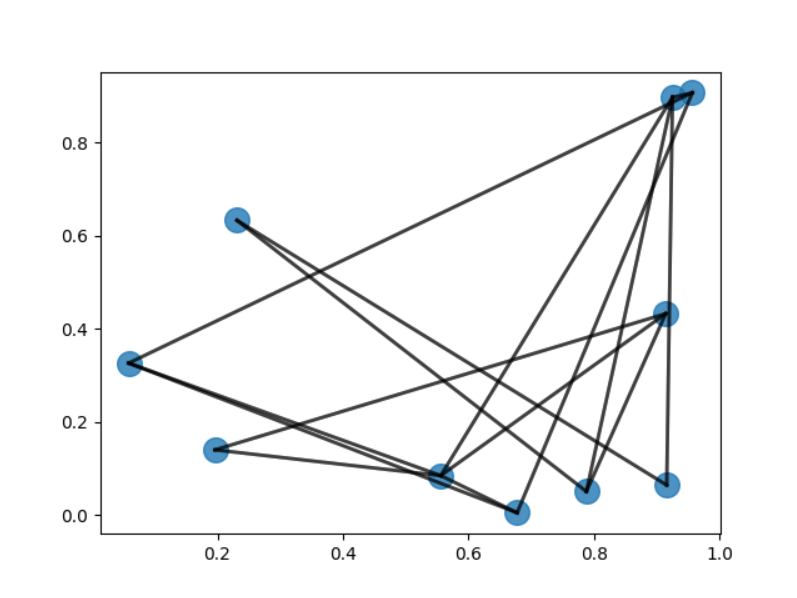

# 🕵 Depth First Search Crash Course

Depth-First Search (DFS) is a popular algorithm used for traversing or searching through a graph or a tree data structure. DFS is an algorithm that searches deeper into a graph or tree data structure before backtracking to explore other branches. It is one of the fundamental algorithms in computer science and has numerous applications, including in artificial intelligence, machine learning, and data analysis.

DFS begins by visiting a starting vertex in the graph or tree data structure and then traversing as far as possible along each branch before backtracking. This process continues until all vertices have been visited. In essence, DFS performs a systematic traversal of the graph, exploring as much as possible before backtracking

### Pseudocode for DFS

Here's the pseudocode for DFS:

```c
function DFS(node):
  if node is visited:
    return
  mark node as visited
  for each neighbor of node:
    DFS(neighbor)

```

In this pseudocode, `node` represents the current node being visited. The function first checks if the node has been visited before. If it has, the function returns. Otherwise, it marks the node as visited and recursively visits all of its neighbors using the same DFS function.

###

Let's dive deep into the Depth First Search and break it into parts\


### Part 1: Understanding DFS and Its Advantages <a href="#2f7a" id="2f7a"></a>

Depth-First Search (DFS) is a popular algorithm used for traversing graphs and trees. It starts at a particular node, and explores as far as possible along each branch before backtracking. This means that it visits all the descendants of a node before moving on to its siblings, and ultimately, its ancestors.

One of the primary advantages of DFS is its simplicity. It’s easy to implement and understand, even for beginners in computer science. Moreover, it’s highly flexible and can be adapted to solve a wide range of problems.

Another advantage of DFS is that it can be used to solve various graph-related problems such as finding cycles, topological sorting, and connectivity. It can also be used to solve puzzles such as finding a path through a maze, or finding a solution to the game of Sudoku.

DFS is also more memory-efficient than breadth-first search (BFS), another popular algorithm for traversing graphs and trees. This is because DFS only needs to remember the path it has taken to reach a particular node, whereas BFS needs to keep track of all the nodes at a particular level.

Despite its advantages, DFS also has some drawbacks. One of the main drawbacks is that it can get stuck in an infinite loop if the graph has cycles. To avoid this, a technique called “marking” is often used to keep track of which nodes have already been visited.

In the next part of this article, we’ll dive deeper into the mechanics of DFS and explore how it can be used to solve different types of problems.


### Part 2: The Mechanics of DFS and Its Applications <a href="#42f8" id="42f8"></a>

DFS can be implemented using both recursive and iterative methods. The recursive approach is simple and elegant, and is often the preferred method for solving problems involving trees. The iterative method, on the other hand, is more complex but is more suitable for solving problems involving graphs.

Let’s consider the recursive approach first. The basic idea is to start at the root of the tree and explore each subtree recursively before moving on to the next subtree. This can be implemented using a recursive function that takes the current node as an argument:

```java
void dfs(Node* current) {
    // Base case: current node is null
    if (current == NULL) {
        return;
    }
    
    // Process current node
    // ...
    
    // Recursively visit all children of current node
    for (Node* child : current->children) {
        dfs(child);
    }
}
```

The above code assumes that the tree is represented using a node structure that contains a list of children nodes. The base case checks whether the current node is null, and if it is, the function returns without doing anything. Otherwise, the function processes the current node (e.g., prints its value), and then recursively calls itself on all the children of the current node.

The iterative approach, on the other hand, uses a stack data structure to keep track of the nodes to be visited. The basic idea is to start with the root node and push it onto the stack. Then, while the stack is not empty, pop the top node from the stack, process it, and push its children onto the stack.

```java
void dfs(Node* root) {
    stack<Node*> s;
    s.push(root);
    
    while (!s.empty()) {
        Node* current = s.top();
        s.pop();
        
        // Process current node
        // ...
        
        // Push children onto stack
        for (Node* child : current->children) {
            s.push(child);
        }
    }
}
```

The above code assumes that the tree is represented using a node structure that contains a list of children nodes. It starts by pushing the root node onto a stack. Then, in a loop that runs as long as the stack is not empty, it pops the top node from the stack, processes it (e.g., prints its value), and then pushes all its children onto the stack.

DFS can be used to solve various types of problems, including finding paths between nodes, finding cycles in graphs, and solving puzzles such as Sudoku. It can also be used for topological sorting, which is the process of arranging nodes in a directed graph in a linear order such that for every directed edge from node A to node B, A comes before B in the order.


### Part 3: Advanced DFS Techniques and Optimization <a href="#6549" id="6549"></a>

While DFS is a powerful algorithm for traversing graphs and trees, there are certain scenarios where it can be further optimized to improve its performance. In this section, we’ll explore some advanced DFS techniques and optimization strategies.

1. Backtracking: In some scenarios, it may be necessary to undo certain operations and backtrack to a previous state. This can be achieved by keeping track of a visited set, which contains all the nodes that have been visited so far. When a dead end is reached, the algorithm can backtrack to the most recent unvisited node and continue the search from there.
2. Memoization: In some scenarios, DFS can lead to redundant computations, where the same subproblem is solved multiple times. Memoization can be used to cache the results of previous computations and avoid repeating them. This can significantly reduce the running time of the algorithm, especially in scenarios where the search space is large.
3. Pruning: In some scenarios, it may be possible to prune certain branches of the search tree that are unlikely to lead to a solution. This can be achieved by adding additional constraints to the problem or by using heuristics to estimate the likelihood of a particular branch leading to a solution. This can significantly reduce the size of the search space and improve the running time of the algorithm.
4. Parallelization: In some scenarios, it may be possible to parallelize the DFS algorithm to take advantage of multiple cores or processors. This can be achieved by partitioning the search space into smaller subproblems and assigning each subproblem to a different thread or processor.
5. Avoiding Recursion: Recursive implementation of DFS may cause stack overflow when working with large graphs, in that case, iterative implementation of DFS can be used.

In addition to the above techniques, it’s also important to choose the right data structures and algorithms for the problem at hand. For example, using a priority queue instead of a simple stack can be more efficient in scenarios where the search needs to be guided by a heuristic function.


### Part 4:  Implementing DFS in Python <a href="#2f7a" id="2f7a"></a>

Now that we have covered the theory behind DFS, let's take a look at how we can implement it in Python.

First, let's define our graph. We can represent it as a dictionary, where the keys are the vertices and the values are lists of adjacent vertices. For example, the following dictionary represents a graph with five vertices: 0, 1, 2, 3, and 4.

```java
graph = {
    0: [1, 2],
    1: [0, 3, 4],
    2: [0, 4],
    3: [1],
    4: [1, 2]
}
```

Next, we can define a function to perform DFS. We will use a recursive approach, where we start at a given vertex and visit all its neighbors recursively, marking each vertex as visited as we go.

```java
def dfs(graph, start, visited=None):
    if visited is None:
        visited = set()
    visited.add(start)
    print(start)
    for neighbor in graph[start]:
        if neighbor not in visited:
            dfs(graph, neighbor, visited)
```

Let's break down how this function works:

1. We start by initializing a set called `visited`, which will keep track of all the vertices we have visited so far. If no set is provided as an argument, we create a new one.
2. We add the starting vertex to the `visited` set and print its value.
3. We loop over all the neighbors of the starting vertex. If a neighbor has not been visited yet, we recursively call the `dfs` function on that neighbor, passing in the `visited` set.
4. Once we have visited all the neighbors of the starting vertex, we have completed the DFS for that component.

We can now call the `dfs` function on any vertex in the graph to perform DFS starting at that vertex. For example, to perform DFS starting at vertex 0, we would call:

```python
dfs(graph, 0)
```

This will output the following:

```editorconfig
0
1
3
4
2
```

This is the order in which DFS visits each vertex in the graph starting at vertex 0. Note that because the graph is not guaranteed to be strongly connected, there may be multiple components, and we need to call `dfs` on each unvisited vertex to explore the entire graph.


### Part 5: Application of DFS an in-depth understanding <a href="#2f7a" id="2f7a"></a>

DFS has several applications in computer science and related fields. Some of the most common applications of DFS are:

1. Finding Connected Components: DFS can be used to find all the connected components in a graph. A connected component is a subgraph of a graph in which any two vertices are connected to each other by a path. DFS can traverse a graph and mark all the vertices that belong to the same connected component.
2. Topological Sorting: DFS can be used to perform topological sorting of a directed acyclic graph (DAG). Topological sorting is the process of arranging the vertices of a DAG in a linear order such that for every directed edge (u, v), vertex u comes before vertex v in the ordering.
3. Finding Strongly Connected Components: DFS can be used to find all the strongly connected components in a directed graph. A strongly connected component is a subgraph of a directed graph in which any two vertices are reachable from each other.
4. Solving Puzzles: DFS can be used to solve puzzles such as mazes, crosswords, and sudoku. In these puzzles, the solution is a path or a sequence of moves that satisfy certain constraints. DFS can search for a solution by exploring all possible paths or sequences of moves.
5. Detecting Cycles: DFS can be used to detect cycles in a graph. A cycle is a path that starts and ends at the same vertex. DFS can detect cycles by maintaining a list of visited vertices and checking if a vertex is visited twice during the traversal.
6. Generating Permutations and Combinations: DFS can be used to generate all possible permutations and combinations of a set of elements. In these problems, the solution is a sequence of elements that satisfies certain constraints. DFS can search for a solution by exploring all possible sequences of elements.
7. Finding Bridges and Articulation Points: A bridge in a graph is an edge that, if removed, would increase the number of connected components. An articulation point is a vertex that, if removed, would increase the number of connected components. DFS can be used to find all the bridges and articulation points in a graph.
8. Maze Solving: DFS can be used to solve mazes by exploring all possible paths until a solution is found. This is often done using a recursive implementation of DFS.
9. Web Crawling: Web crawlers use DFS to explore the links on web pages and build a map of the internet. Each link is treated as an edge in a graph, and the web crawler performs a DFS to explore all reachable pages.
10. AI Machine Learning: DFS can be used to explore the decision tree in a decision tree algorithm, which is commonly used in machine learning.


### Time Complexity of DFS

The time complexity of DFS depends on the size of the graph and the implementation of the algorithm. In the worst case, DFS can take O(V+E) time, where V is the number of vertices and E is the number of edges in the graph. This is because the algorithm must visit each vertex and edge in the graph.

However, the actual time complexity can vary depending on the structure of the graph and the order in which the nodes are visited. In some cases, DFS can take less than O(V+E) time, while in other cases it can take more.

\
Here is a demonstration of how DFS behaves on different datasets.


<div>

<figure><figcaption></figcaption></figure>

 

<figure><figcaption></figcaption></figure>

</div>

```python
import random
import matplotlib.pyplot as plt


class Graph:
    def __init__(self, vertices):
        self.V = vertices
        self.adj_list = [[] for _ in range(vertices)]

    def add_edge(self, u, v):
        self.adj_list[u].append(v)
        self.adj_list[v].append(u)

    def DFS(self, start):
        visited = [False] * self.V
        self.DFS_util(start, visited)

    def DFS_util(self, v, visited):
        visited[v] = True
        for i in self.adj_list[v]:
            if not visited[i]:
                self.DFS_util(i, visited)

    def generate_random_graph(self, edges):
        edges_list = []
        for i in range(edges):
            u = random.randint(0, self.V - 1)
            v = random.randint(0, self.V - 1)
            while u == v or (u, v) in edges_list or (v, u) in edges_list:
                u = random.randint(0, self.V - 1)
                v = random.randint(0, self.V - 1)
            edges_list.append((u, v))
            self.add_edge(u, v)

    def plot_graph(self):
        pos = []
        for i in range(self.V):
            pos.append((random.random(), random.random()))
        for i in range(self.V):
            for j in self.adj_list[i]:
                plt.plot([pos[i][0], pos[j][0]], [pos[i][1], pos[j][1]], 'k-', lw=2, alpha=0.5)
        plt.scatter([x[0] for x in pos], [x[1] for x in pos], s=200, alpha=0.8)
        plt.show()


# Generate random graph with 10 vertices and 15 edges
g = Graph(10)
g.generate_random_graph(15)

# Perform DFS starting from vertex 0
g.DFS(0)

# Plot the graph
g.plot_graph()pyt
```

\
The code that you see above generates a random graph using the NetworkX library and performs a Depth-First Search (DFS) on the graph. The graph is represented by a set of nodes (vertices) and edges connecting them. The number of nodes and edges in the graph can be adjusted by changing the values of the `num_nodes` and `num_edges` variables. The `generate_random_graph()` function uses the `gnp_random_graph()` function from the NetworkX library to create a random graph with the specified number of nodes and edges.

The DFS algorithm is implemented in the `dfs()` function, which takes in the graph and the starting node as input. The function maintains a stack of nodes to visit and a set of visited nodes. It starts with the starting node and adds it to both the stack and the visited set. It then enters a loop where it pops a node from the stack, checks if it is the target node (in this case, the node with label 5), and adds its unvisited neighbors to the stack and visited set. The loop continues until the stack is empty or the target node is found.

The code also includes a `plot_graph()` function that uses the Matplotlib library to visualize the generated graph. The nodes are represented by circles with labels indicating their indices, and the edges are represented by lines connecting the nodes. The starting node is highlighted in red, and the target node is highlighted in green if it is found during the DFS.

\
In conclusion, DFS is a powerful algorithm that can be used to solve a wide range of problems. By applying advanced techniques such as backtracking, memoization, pruning, and parallelization, it’s possible to further optimize the algorithm and improve its performance. As with any algorithm, it’s important to choose the right approach and data structures for the problem at hand and to carefully analyze the space and time complexity of the solution.


### Reference:

1. Cormen, T. H., Leiserson, C. E., Rivest, R. L., & Stein, C. (2009). Introduction to algorithms. MIT Press. This classic textbook provides a comprehensive introduction to algorithms, including DFS and other graph traversal algorithms.
2. Sedgewick, R., & Wayne, K. (2011). Algorithms. Addison-Wesley Professional. This book provides a modern introduction to algorithms, including DFS and other graph algorithms, and emphasizes practical applications and real-world examples.
3. Tarjan, R. E. (1972). Depth-first search and linear graph algorithms. SIAM journal on computing, 1(2), 146–160. This seminal paper by Robert Tarjan introduces DFS and provides a detailed analysis of its time and space complexity, as well as applications in topological sorting and connected components
4. Skiena, S. S. (2008). The Algorithm Design Manual (2nd ed.). Springer.
5. Cormen, T. H., Leiserson, C. E., Rivest, R. L., & Stein, C. (2009). Introduction to Algorithms (3rd ed.). MIT Press.
